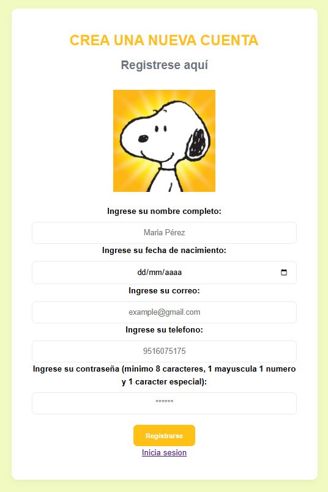
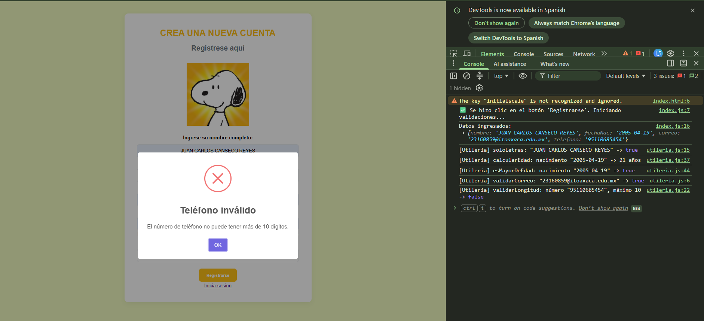
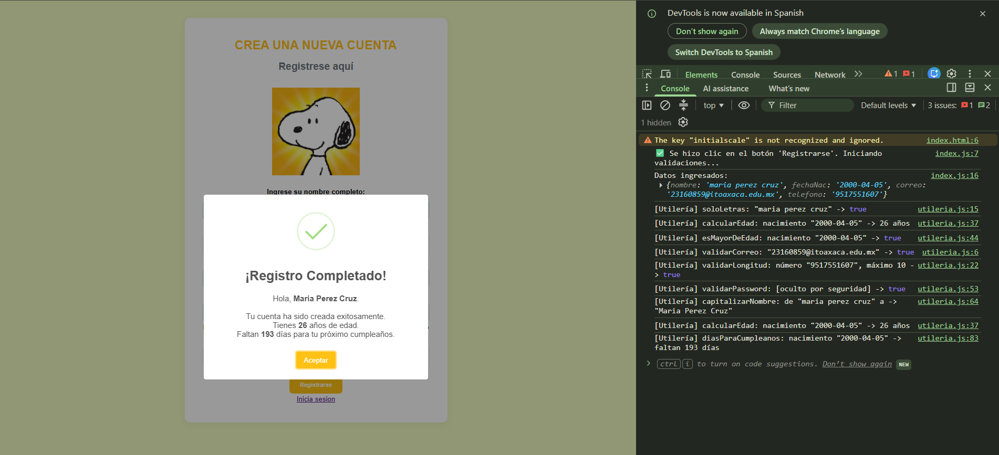
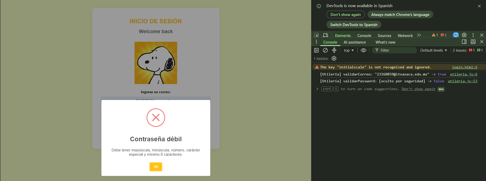
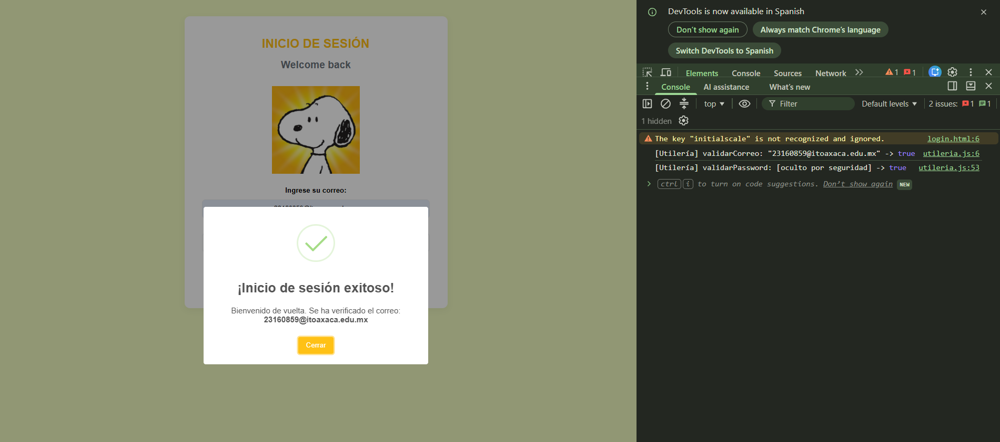

# TECNOLOGICO NACIONAL DE MEXICO
### **INSTITUTO TECNOLOGICO DE OAXACA**
### **Utilería JS - Validación de Formularios**
### **Autor** Canseco Reyes Juan Carlos
### **Materia:** Programacion Web
### **Profesor** Martinez Nieto Adelina
**Problema que resuelve:** Evita la entrada de datos basura (nombres con números, correos mal formados, contraseñas débiles o menores de edad) en los formularios web, centralizando las validaciones en una sola librería ligera sin dependencias.

---

## Instalación
Para utilizar esta librería en cualquier proyecto, simplemente enlaza el script en tu documento HTML, preferentemente antes del cierre de la etiqueta `</body>` o en el `<head>` con el atributo `defer`:

```html
    <head>
        <script src="js/utileria.js" defer></script>
    </head>

    o
    
    <script src="js/utileria.js"></script> --antes de finalizar el body


```
## Libreria utileria.js

### 1. Validar Correo Electrónico
Valida que una cadena cumpla con la estructura oficial de un correo electrónico.

```js
function validarCorreo(correo) {
    const regex = /^[a-zA-Z0-9._-]+@[a-zA-Z0-9.-]+\.[a-zA-Z]{2,6}$/;
    const resultado = regex.test(correo);
    console.log(`[Utilería] validarCorreo: "${correo}" ->`, resultado);
    return resultado;
}

```
### 2. Validar Solo Letras
Comprueba que el texto contenga únicamente caracteres alfabéticos, espacios y vocales acentuadas.
```js
function soloLetras(texto) {
    const regex = /^[a-zA-ZáéíóúÁÉÍÓÚñÑ\s]+$/;
    const resultado = regex.test(texto);
    console.log(`[Utilería] soloLetras: "${texto}" ->`, resultado);
    return resultado;
}

```
### 3. Validar Longitud de Numero
Verifica que la longitud de una cadena numérica no rebase un límite máximo establecido (en este caso 10 ya que se trata de un telefono)
```js
function validarLongitud(numero, maxLongitud) {       
    const resultado = String(numero).length <= maxLongitud;
    console.log(`[Utilería] validarLongitud: número "${numero}", máximo ${maxLongitud} ->`, resultado);
    return resultado;
}

```
### 4. Calcular Edad
Calcula la edad apartir de una fecha de nacimiento 

```js
function calcularEdad(fechaNacimiento) {
    const hoy = new Date();
    const nacimiento = new Date(fechaNacimiento + 'T00:00:00'); // Evita desfase de zona horaria
    let edad = hoy.getFullYear() - nacimiento.getFullYear();
    const mes = hoy.getMonth() - nacimiento.getMonth();
    
    // Si el mes actual es menor al mes de nacimiento, o si es el mismo mes pero el día actual es menor, restamos un año.
    if (mes < 0 || (mes === 0 && hoy.getDate() < nacimiento.getDate())) {
        edad--;
    }
    console.log(`[Utilería] calcularEdad: nacimiento "${fechaNacimiento}" -> ${edad} años`);
    return edad;
}
```
### 5. Validar Mayoria de Edad
Retorna un booleano indicando si la persona es mayor o igual a 18 años.

```js
function esMayorDeEdad(fechaNacimiento) {
    const resultado = calcularEdad(fechaNacimiento) >= 18;
    console.log(`[Utilería] esMayorDeEdad: nacimiento "${fechaNacimiento}" ->`, resultado);
    return resultado;
}
```
### 6. Validar Contraseña Segura
Valida que la copntraeña tenga un mínimo de 8 caracteres, al menos una letra mayúscula, una minúscula, un número y un carácter especial..

```js
function validarPassword(password) {
    const regex = /^(?=.*[A-Z])(?=.*\d)(?=.*[!@#$%^&*(),.?":{}|<>])[A-Za-z\d!@#$\%^&*(),.?":{}\vert{}<>]{8,}$/;
    const resultado = regex.test(password);
    console.log(`[Utilería] validarPassword: [oculto por seguridad] ->`, resultado);
    return resultado;
}
```
### 7. Capitalizar Nombre
Si el usaurio ingresa su  nombre solo en mayusculas o minusculas esta capitaliza para que solo la primer letra sea mayuscula

```js
function capitalizarNombre(nombreCompleto) {
    if (!nombreCompleto) return "";
    const resultado = nombreCompleto.toLowerCase().trim().split(' ')
        .map(palabra => palabra.charAt(0).toUpperCase() + palabra.slice(1))
        .join(' ');
    
    console.log(`[Utilería] capitalizarNombre: de "${nombreCompleto}" a -> "${resultado}"`);
    return resultado;
}
```
### 8. Calcula Dias Para Cumpleaños
Calcula a partir de la fecha de nacimiento cuantos dias faltan para tu proximo cumpleaños

```js
function diasParaCumpleanos(fechaNacimiento) {
    const hoy = new Date();
    hoy.setHours(0, 0, 0, 0); 
    const nacimiento = new Date(fechaNacimiento + 'T00:00:00');
    
    let proximoCumple = new Date(hoy.getFullYear(), nacimiento.getMonth(), nacimiento.getDate());
    
    if (hoy.getTime() > proximoCumple.getTime()) {
        proximoCumple.setFullYear(hoy.getFullYear() + 1);
    }
    
    const diferencia = proximoCumple.getTime() - hoy.getTime();
    const resultado = Math.ceil(diferencia / (1000 * 60 * 60 * 24));
    
    console.log(`[Utilería] diasParaCumpleanos: nacimiento "${fechaNacimiento}" -> faltan ${resultado} días`);
    return resultado;
}
```
## Caputras de Pantalla
### Interfaz para registro de usuario:

### Interfaz de el login:

### Ejemplo de error de registro en consola podemos vwer todas las validaciones hechas y en cual fallo y detuvo la ejecucion de el registro:

### Registro exitoso poemos ver en consola todas las validaciones y calculos hechos para el registro:

### Error en login nos dice que validacion fallo si el correo o la contraseña:

### Login exitoso:



